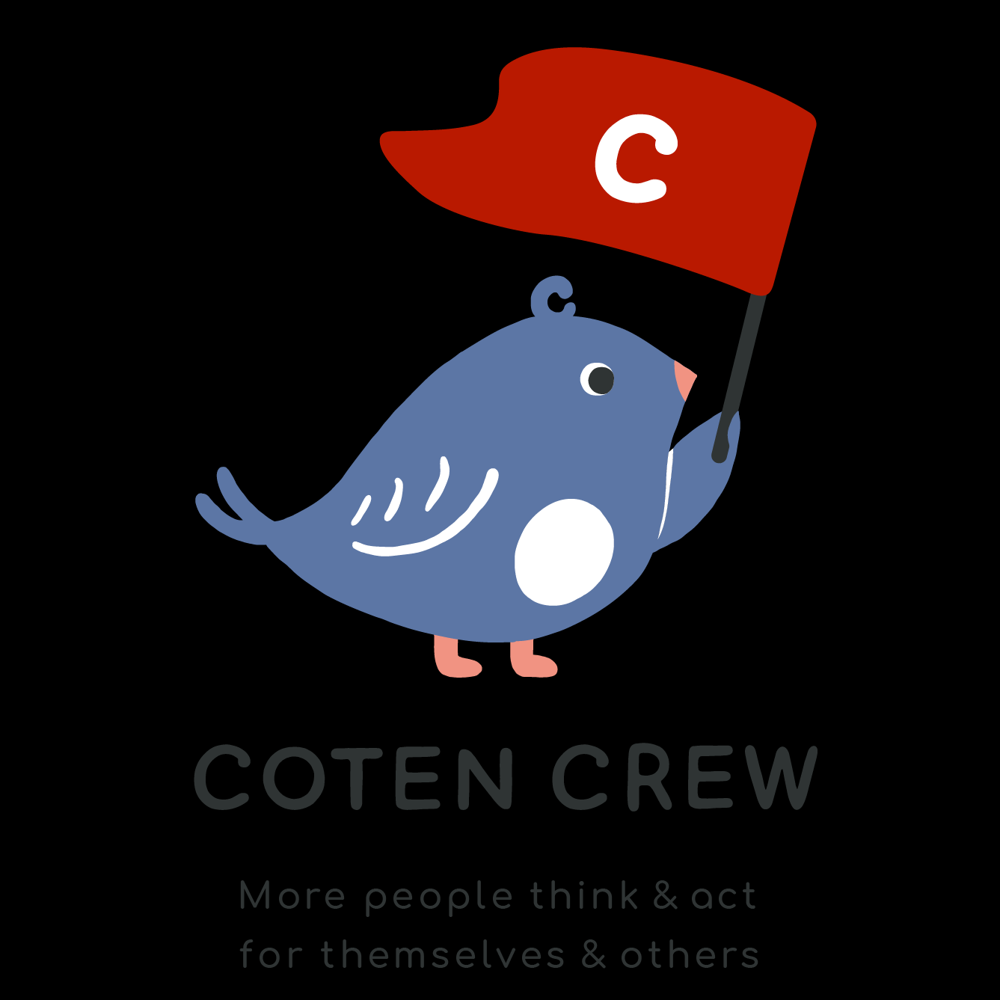

<!--
**itachi-P/itachi-p** is a ✨ _special_ ✨ repository because its `README.md` (this file) appears on your GitHub profile.
Here are some ideas to get you started:
-->
<h1 align="center">Hi there 👋</h1>
Now Studying:

ITエンジニア復帰は諦めたが、2026年3月現在、必要性を感じ新SNS開発中。 
I like <a href="https://www.youtube.com/c/cotenradio">COTENRADIO</a> and I'm COTENCREW. 

## Recent study records

### created Apps :
  
- [ぬこ🐈画像ジェネレータ](https://random-cat-git-feature-itachi-p.vercel.app/) <Next.js & TypeScript> ただひたすら猫画像をランダムに拾ってくる…
- [世界のお天気⛈️🌞🌪️](https://weather-report-react-ts.netlify.app/)　<React & TypeScript> 世界の都市の現在の天候・気温を表示（マルチ言語対応）
- [Next.js公式テストブログ📝アプリ](https://nextjs-testapp02-blog.netlify.app/)+α　<Next.js> 公式ハンズオンそのまんまに毛が生えた程度のカスタム

#### Other portfolios created so far :
- Python & Selenium & pandas🐼 ~~&FastAPI~~ によるWebスクレイピング _（API化は未実装）_　・・・指定の動物種の画像を指定のサイズで収集（画像そのもののダウンロード、またはJSON形式で返す）
- PHP & Laravel & Docker & AWS ECS ・・・(AWSの利用経費節約のため稼働停止中）
- Flutter & Firebase & NoSQL(FireStore) による3週間de習慣形成スマホアプリ　・・・（ほぼ完成したが、未正式リリース）

  
Reading Books

###### Now reading
- [『ちょうぜつソフトウェア設計入門――PHPで理解するオブジェクト指向の活用 Kindle版』](https://amzn.asia/d/eaqi55m)
- その他：[読書ミーター](https://bookmeter.com/users/1441045)
  
###### Recently read books:

- [達人プログラマー(第2版): 熟達に向けたあなたの旅](https://www.amazon.co.jp/dp/4274226298)
- (再読)[The Art of Readable Code](https://www.amazon.co.jp/dp/4873115655)
- [「頭のゴミ」を捨てれば、脳は一瞬で目覚める!](https://www.amazon.co.jp/dp/B00JP3222M/)
- [モチベーション3.0](https://www.amazon.co.jp/dp/4062144492)
- [SOFT SKILLS ソフトウェア開発者の人生マニュアル 第2版](https://www.amazon.co.jp/dp/4296000500/)
- [世界は贈与でできている　資本主義の「すきま」を埋める倫理学](https://www.amazon.co.jp//dp/B085NJC1HD/)
- [Humankind 希望の歴史(上・下)　人類が善き未来をつくるための18章](https://www.amazon.co.jp/dp/4163914072/)

#### Technologies I've used in the past:

  <a href="https://skillicons.dev">
     
     
     
     
  </a>

#### Recent learning Languages & Tools:

  
  
  
   
  

