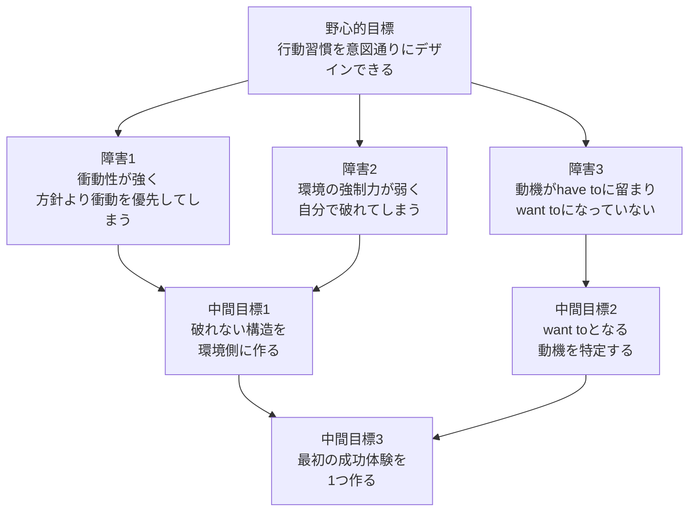
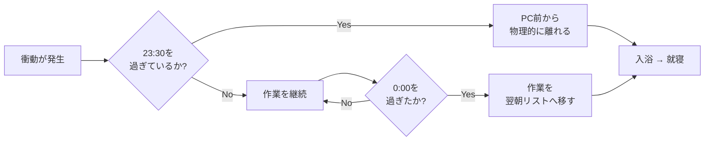
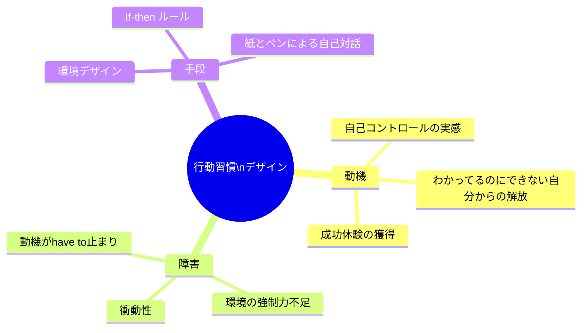
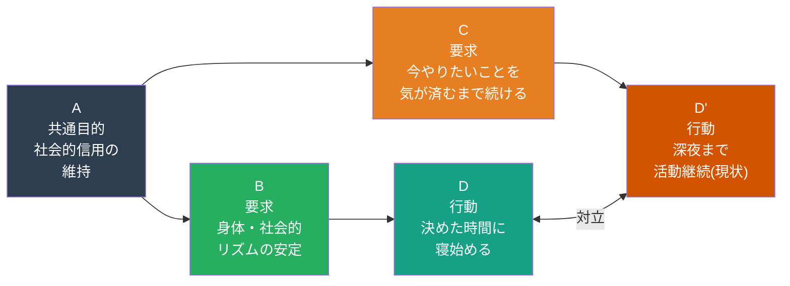

# Mermaid レンダリング確認用サンプル

GitHubでこのファイルを開いた時に、以下の各ブロックが図としてレンダリングされるかを確認する。

---

## 1. flowchart TD(上から下)

ATTやロジックブランチに向く。

---

## 2. flowchart LR(左から右)

因果関係や処理フローに向く。

---

## 3. mindmap(放射状)

簡易な階層構造に向く。複雑なものはPNG静画の方が良い。

---

## 4. TOCfEクラウド図の代替表現(flowchart LR)

本来のクラウド図の構造を完全再現はできないが、参考として。

---

## 確認事項

- [ ] flowchart TD がレンダリングされるか
- [ ] flowchart LR がレンダリングされるか
- [ ] mindmap がレンダリングされるか
- [ ] クラウド代替表現でどこまで構造が伝わるか
- [ ] 日本語テキストが文字化けしないか

---

*このファイルは確認後、削除またはprojects/thinking-tools/配下に移動する*
